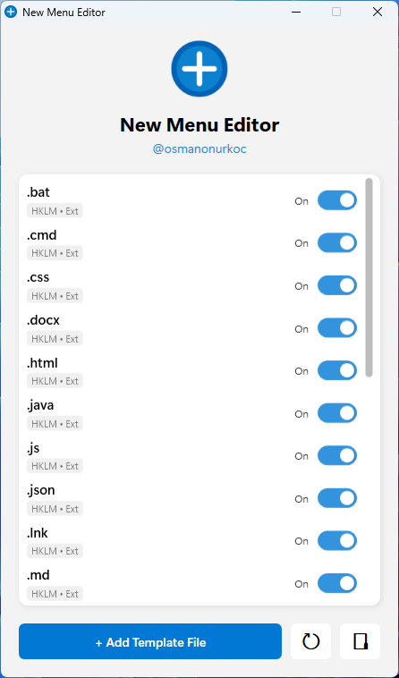
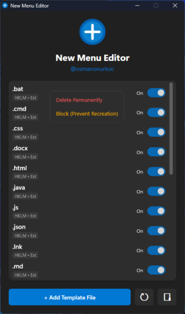

# 📂 Windows New Menu Editor

A lightweight, powerful PowerShell utility with a modern WPF interface to organize, clean, and manage the Windows "Right Click > New" context menu.

## 📸 Overview

*Is your "New" menu cluttered with files you never create? Clean it up instantly.*

This tool scans the Windows Registry (`HKCU` & `HKLM`) for all file extensions registered in the "ShellNew" subsystem. It allows you to toggle them on/off instantly or permanently delete them.

## 📸 Screenshots

  
  

## ✨ Key Features

* **🎨 Modern UI & Theme Engine:** Automatically detects your Windows System Theme (Dark/Light Mode) and adjusts the interface colors accordingly.
* **🔇 Silent Mode:** Designed for speed. Toggles, deletions, and blocks happen instantly without annoying "Are you sure?" popups.
* **🛡️ Persistence Lock (Block Feature):**
  * Some apps recreate their menu items when updated or opened.
  * **Solution:** Right-click an item and select **"Block"**. This modifies the Registry ACL (Permissions) to `Deny` access, effectively preventing the app from adding the item back.
* **➕ Template Manager:** Easily add your own custom file templates (e.g., `.py`, `.js`, `.md`) to the menu using a simple file picker.
* **🚀 Native PowerShell:** No external dependencies or DLLs required. Runs on standard Windows installations.

## 🚀 Getting Started

### Prerequisites
* **OS:** Windows 10 or Windows 11.
* **Runtime:** PowerShell 5.1 (Pre-installed on Windows) or PowerShell 7+.

### Installation & Usage
#Exe:
1. Download the latest `NewMenuEditor.exe` from the **[Releases Page](https://github.com/osmanonurkoc/win_new_menu_editor/releases/latest)**.
2. Right-click aand **Run as Administrator**.

#PS1:
1. Download the latest `NewMenuEditor.ps1` from the **[Source Code](https://github.com/osmanonurkoc/win_new_menu_editor/archive/refs/heads/main.zip)**.
2. Right-click the file and select **Run with PowerShell**.
   * *Note:* The tool requires Administrator privileges to modify HKLM keys. It will auto-request elevation if started as a standard user.
   > **Note:** If you run into execution policy errors, open PowerShell as Admin and run: `Set-ExecutionPolicy -Scope Process -ExecutionPolicy Bypass`.
   
## ⚙️ How It Works

### Registry Scanning
The tool looks for `ShellNew` keys in:
* `HKEY_CLASSES_ROOT` (Merged view)
* `HKEY_CURRENT_USER\Software\Classes`
* `HKEY_LOCAL_MACHINE\Software\Classes`

### Disabling Items
When you toggle an item **OFF**, the tool renames the registry key from `ShellNew` to `_ShellNew_Disabled`. This preserves the data while hiding it from Windows Explorer. Toggling it **ON** reverses this process.

### Blocking Items
The "Block" feature creates an empty key and sets the **Access Control List (ACL)** to `Deny Everyone`. This creates a "dead zone" in the registry that installers cannot overwrite.

## ⚠️ Disclaimer
This tool modifies the Windows Registry. While it includes safety checks (renaming instead of deleting by default), **use it at your own risk**. 

## 📄 License
This project is licensed under the [MIT License](LICENSE).

---
*Created by [@osmanonurkoc](https://github.com/osmanonurkoc)*
